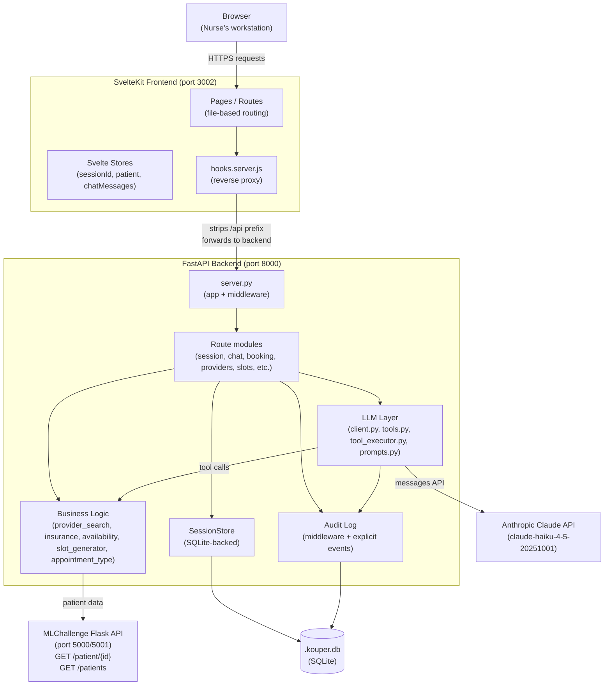

# Kouper — Architecture & Design Document

> **Audience:** Engineers, PMs, and Tech Leads
> **Purpose:** Comprehensive reference for anyone who has never seen this codebase
> **Last Updated:** 2026-03-25

---

## Table of Contents

1. [Project Overview](#1-project-overview)
2. [System Architecture](#2-system-architecture)
3. [Technology Stack](#3-technology-stack)
4. [Backend Design](#4-backend-design)
   - [4.1 FastAPI Application](#41-fastapi-application-serverpy)
   - [4.2 LLM Integration](#42-llm-integration)
   - [4.3 Business Logic](#43-business-logic)
   - [4.4 Data Layer](#44-data-layer)
   - [4.5 Data Models](#45-data-models)
5. [Frontend Design](#5-frontend-design)
   - [5.1 SvelteKit Architecture](#51-sveltekit-architecture)
   - [5.2 Application State](#52-application-state)
   - [5.3 User Flow](#53-user-flow-step-by-step)
   - [5.4 Key Components](#54-key-components)
   - [5.5 API Client](#55-api-client-clientjs)
6. [Key Design Decisions](#6-key-design-decisions)
7. [Data Flow: End-to-End Example](#7-data-flow-end-to-end-example)
8. [Deployment](#8-deployment)
9. [Known Limitations & Future Work](#9-known-limitations--future-work)

---

## 1. Project Overview

### What Kouper Is

Kouper is a care coordinator tool for hospital nurses. It assists with the post-discharge referral booking workflow: after a patient leaves the hospital, they typically have one or more referrals to specialist providers. Booking these appointments is a multi-step process involving patient identity verification, insurance checks, provider selection, scheduling, and patient communication.

Kouper provides an LLM-powered assistant embedded in a structured wizard UI that guides the nurse step by step through this workflow. The LLM answers questions, surfaces relevant information, and calls deterministic business logic tools — it never makes booking decisions on its own.

### Who Uses It

**Primary user:** Hospital care coordinator nurses. They use Kouper immediately after a patient is discharged to book follow-up specialist appointments while the patient is still at the care site (or reachable by phone).

**Secondary user:** Supervisors and engineers who use the Audit Log view to monitor LLM behavior, nurse actions, and system health.

### The Problem It Solves

Post-discharge appointment booking involves a surprising amount of complex domain logic:

- Determining whether a patient is NEW or ESTABLISHED for a specialty (a billing requirement with a 5-year completed-visit rule)
- Verifying insurance coverage per provider (different providers accept different plans)
- Surfacing self-pay rates when insurance is not accepted
- Handling patients with multiple referrals from a single discharge
- Knowing when providers share a location and same-day scheduling is possible
- Managing patient communication preferences for follow-up reminders

Without assistance, nurses must manually navigate EHR systems, call provider offices, and mentally track multi-step workflows across many patients per shift. Kouper reduces this to a guided, audited flow.

### Core Workflow in Plain English

1. Nurse searches for the patient by name in the dashboard
2. Nurse verbally verifies the patient's identity (name + DOB) and checks a confirmation box
3. A session is created and the patient's EHR data (discharge referrals, appointment history) is loaded
4. The nurse sees all referrals that need booking at a glance
5. For each referral:
   - Insurance is confirmed or captured
   - A provider is selected from the matching specialty list
   - Appointment type (NEW/ESTABLISHED) is automatically determined from appointment history
   - A time slot is chosen from a 3-week calendar grid
   - Patient preferences (contact method, language, transport) are collected
   - The booking is reviewed and confirmed
6. When all referrals are booked, the session is marked complete
7. Outcome logging, reminder scheduling, and a summary sent to the patient complete the workflow

At any point, the nurse can open the LLM chat panel and ask questions in natural language. The assistant has full context about the current screen and session state.

---

## 2. System Architecture

### High-Level Diagram



### Component Responsibilities

| Component | Location | Responsibility |
|-----------|----------|---------------|
| SvelteKit pages | `frontend/src/routes/` | Each step of the booking wizard as a route |
| hooks.server.js | `frontend/src/hooks.server.js` | Reverse-proxies `/api/*` to FastAPI; keeps backend URL out of browser |
| Svelte stores | `frontend/src/lib/stores/session.js` | Global session state shared across pages |
| API client | `frontend/src/lib/api/client.js` | All backend calls; single source of truth for API URLs |
| ChatPanel | `frontend/src/lib/components/ChatPanel.svelte` | Floating LLM chat widget present on every booking step |
| FastAPI app | `backend/app/server.py` | App instantiation, CORS, audit middleware, router registration |
| Route modules | `backend/app/routes/` | REST endpoints, one file per domain |
| Business logic | `backend/app/logic/` | Deterministic Python functions; no LLM involvement |
| LLM client | `backend/app/llm/client.py` | Agentic tool-use loop; conversation threading |
| LLM tools | `backend/app/llm/tools.py` | Tool schema definitions exposed to Claude |
| Tool executor | `backend/app/llm/tool_executor.py` | Dispatcher: tool name → Python function |
| System prompt | `backend/app/llm/prompts.py` | Builds full system prompt from static data + session state |
| Session store | `backend/app/session_store.py` | SQLite-backed CRUD for `BookingSession` objects |
| Database | `backend/app/database.py` | SQLite connection manager + schema migrations |
| Audit log | `backend/app/audit_log.py` | Unified event log (api / llm / system / nurse types) |
| Patient API client | `backend/app/api/patient_client.py` | HTTP client for MLChallenge Flask API |
| Provider data | `backend/app/data/providers.py` | In-memory static list of 5 providers |
| Insurance data | `backend/app/data/insurance.py` | Accepted plans, self-pay rates, prior-auth rules |

---

## 3. Technology Stack

| Layer | Technology | Version / Notes |
|-------|-----------|-----------------|
| Frontend framework | SvelteKit | File-based routing, SSR capable |
| Frontend adapter | @sveltejs/adapter-node | Produces a Node.js server for production |
| Frontend process manager | PM2 | App name: `kouper`, port 3002 |
| Markdown rendering | `marked` | Used in ChatPanel for LLM responses |
| Backend framework | FastAPI | Python, automatic OpenAPI docs at `/docs` |
| Backend runtime | Python 3.x with uvicorn | ASGI server |
| HTTP client (backend) | `httpx` | Synchronous client for patient API calls |
| LLM provider | Anthropic | Model: `claude-haiku-4-5-20251001` |
| LLM SDK | `anthropic` Python SDK | Tool-use (function calling) API |
| Database | SQLite | Single file: `.kouper.db` at project root |
| Database access | Raw `sqlite3` (stdlib) | No ORM; schema managed in `database.py` |
| Data validation | Pydantic v2 | All models are Pydantic BaseModels |
| Patient data source | MLChallenge Flask API | Runs separately; port 5000 (configurable via `PATIENT_API_URL`) |
| Environment config | `python-dotenv` | `.env` file at project root |

### Why This Stack

- **SvelteKit + adapter-node:** Produces a deployable Node server that can serve both SSR pages and handle the API proxy in `hooks.server.js`, eliminating any need for a separate reverse proxy.
- **FastAPI:** Zero-friction Pydantic integration, auto-generated API docs, async-capable, and type-safe by default.
- **Claude Haiku:** The `claude-haiku-4-5-20251001` model balances speed and capability for a tool-use loop that may run 2–5 LLM API calls per nurse message.
- **SQLite:** Sufficient for a single-machine deployment; no setup overhead; the schema lives in code and is migrated on startup.

---

## 4. Backend Design

### 4.1 FastAPI Application (`server.py`)

**File:** `backend/app/server.py`

The application is instantiated once and configured with:

#### Audit Middleware

A custom HTTP middleware runs on every request:

```python
@app.middleware("http")
async def audit_middleware(request: Request, call_next):
```

It:
1. Calls `call_next` to execute the actual request (response-first design — timing includes the full request).
2. Extracts `session_id` from paths matching `/session/{uuid}/...` using a regex.
3. Writes an `api`-type `AuditLogEntry` with method, path, status code, and duration.
4. Skips the `/audit` endpoint itself to prevent infinite recursion.
5. Wraps all of this in a `try/except` that silently swallows failures — the audit layer must never crash a request.

#### CORS Configuration

CORS is permissive for local development:

```python
allow_origins=["http://localhost:5173", "http://localhost:3000", "http://localhost:4173"]
```

In production (accessed through SvelteKit's proxy), CORS is not needed because the browser only talks to SvelteKit. The CORS configuration exists for development convenience when running the backend standalone.

#### Router Registration

Eighteen routers are registered. They are split into files by domain:

| Router | Prefix | Domain |
|--------|--------|--------|
| `session.router` | `/session` | Session lifecycle (create, get state, delete, insurance, reminders) |
| `patient.router` | `/patients` | Patient search (EHR + local) |
| `patient.router2` | `/session` | Patient load into session |
| `chat.router` | `/session` | LLM message endpoint |
| `booking.router` | `/session` | Confirm booking, get summary |
| `providers.router` | `/providers` | Provider directory |
| `slots.router` | `/session` | Appointment slot generation |
| `insurance.router` | `/session` | Insurance check |
| `new_patient.router` | `/patients/local`, `/session` | Local patient creation |
| Others | various | Preferences, distance, send-summary, audit, transport, outcomes, feedback, appointment-info |

The `patient` route module exports two routers (`router` and `router2`) because one serves `/patients` (search) and the other serves `/session/{id}/start/{patient_id}` (session-scoped). This is an explicit design note in `server.py`.

---

### 4.2 LLM Integration

#### The Agentic Tool-Use Loop (`client.py`)

**File:** `backend/app/llm/client.py`

The core function is `chat(message, conversation_history, patient, session, page_context)`.

```
Nurse message arrives
       │
       ▼
Append to conversation history as {"role": "user", "content": message}
       │
       ▼
Build system prompt (includes patient context + session state + provider directory)
Append page_context if provided
       │
       ▼
┌─────────────────────────────────────────────────────────┐
│  while True:                                            │
│    response = client.messages.create(                   │
│        model="claude-haiku-4-5-20251001",               │
│        max_tokens=2048,                                 │
│        system=system_prompt,                            │
│        tools=TOOLS,                                     │
│        messages=history                                 │
│    )                                                    │
│                                                         │
│    if response.stop_reason == "tool_use":               │
│      for each block in response.content:                │
│        if tool_use block:                               │
│          result = execute_tool(block.name, block.input) │
│          audit_entry(llm, tool_name, input, output)     │
│          append tool_result to tool_results[]           │
│      history += [assistant turn, user turn with results]│
│      continue loop                                      │
│                                                         │
│    else:  # stop_reason == "end_turn"                   │
│      extract text from content                          │
│      history += [assistant turn]                        │
│      return (final_text, history)                       │
└─────────────────────────────────────────────────────────┘
```

**Key design points:**

- **Full conversation threading:** Every call passes the complete `conversation_history` list. History grows with each turn and is persisted to the session after the function returns. The model has full conversational context across all of the nurse's messages in the session.

- **Tool results as user turns:** The Anthropic API requires tool results to be submitted as a `user` role message immediately following the `assistant` turn that contained the `tool_use` blocks. The loop builds both turns atomically.

- **Multiple tools per turn:** A single LLM response may request several tools simultaneously. The loop iterates all blocks in `response.content` before continuing.

- **Reasoning hint capture:** The helper `_extract_text_blocks()` pulls any text blocks the model produced in the same turn as a tool call. This is the model "thinking out loud" and is stored as `reasoning_hint` in the audit log — making LLM chain-of-thought visible to reviewers.

- **Page context injection:** The frontend passes a `page_context` string on every message (e.g., `"Screen: Provider Selection (Step 3) — Referral 1\nSpecialty needed: Orthopedics\n..."`). This is appended to the system prompt under `## Current Screen Context`, allowing the model to give contextually relevant answers without the nurse having to explain what screen they're on.

#### Tool Vocabulary (`tools.py`)

**File:** `backend/app/llm/tools.py`

Five tools are exposed to the model. Each follows the Anthropic tool-use schema with a `name`, `description`, and `input_schema`.

| Tool | Purpose | Input |
|------|---------|-------|
| `lookup_patient` | Load a patient's complete record | `patient_id: str` |
| `get_providers` | Find all providers for a specialty | `specialty: str` |
| `check_availability` | Get a provider's available days, hours, and locations | `provider_name: str` |
| `determine_appointment_type` | NEW vs. ESTABLISHED for a patient/specialty pair | `specialty: str` |
| `check_insurance` | Insurance acceptance + self-pay rate if rejected | `insurance_name: str`, `specialty: str` |

The `description` field in each tool definition is crafted to tell the model *when* to call the tool, not just what it does. This is prompt engineering inside the tool schema — critical for correct tool selection.

#### Tool Executor (`tool_executor.py`)

**File:** `backend/app/llm/tool_executor.py`

`execute_tool(tool_name, tool_input, session_patient)` is the dispatcher. It:

1. Maps `tool_name` to the appropriate logic function.
2. Handles the `lookup_patient` tool as a no-op (patient data is already in the system prompt via the session; the tool exists so the model can reference it but it returns a simple acknowledgment).
3. Converts all results to JSON strings — the format required by the Anthropic API for `tool_result` content blocks.
4. Provides structured error handling via the `ErrorCode` enum:
   - `PATIENT_NOT_FOUND` — PatientNotFound exception
   - `API_UNAVAILABLE` — APIUnavailable exception
   - `PROVIDER_NOT_FOUND` — ValueError with "not found" in the message
   - `INVALID_INPUT` — other ValueErrors
   - `UNKNOWN` — catch-all

Error responses include a `user_message` field containing nurse-readable text. The system prompt instructs the model: "When a tool returns `"error": true`, relay the `user_message` field to the nurse verbatim." This keeps stack traces and error codes away from the UI while preserving them in the audit log.

#### System Prompt Design (`prompts.py`)

**File:** `backend/app/llm/prompts.py`

The system prompt is rebuilt from scratch on every conversation turn by `build_system_prompt(patient_context, session)`. It is structured as a reference document with these sections:

1. **Provider Directory** — `build_provider_directory()` renders the full `PROVIDERS` list as formatted text (name, certification, specialty, and per-department address/phone/hours). Including this statically saves one `get_providers` tool call per turn and lets the model reason across all providers simultaneously.

2. **Appointment Rules** — Hardcoded: NEW = 30 min, arrive 30 min early; ESTABLISHED = 15 min, arrive 10 min early; 5-year completed-visit rule.

3. **Accepted Insurances** — Full list from `ACCEPTED_INSURANCES`.

4. **Self-Pay Rates** — Full rate table from `SELF_PAY_RATES`.

5. **Role instructions** — Keeps the model focused on the nurse's workflow; instructs it to use tools, never guess, and always include arrival time guidance.

6. **Co-location Scheduling Tip** — A hardcoded prompt about Dr. House and Dr. Brennan both practicing at Jefferson Hospital in Claremont, NC, and overlapping on Thursdays. The model is instructed to proactively suggest same-day booking to minimize patient travel.

7. **Current Patient Context** — `build_patient_context(patient)` formats the patient dict: name, DOB, PCP, referred providers with specialties, and full appointment history including status. The model uses this history to determine appointment type without a tool call.

8. **Current Session State** — `build_session_state_section(session)` adds a block showing the current step, active referral index, all completed bookings (provider, location, appointment type), and all pending referrals. This is rebuilt each turn from the live session object.

**Why rebuild every turn?** Session state changes after every tool call and every booking confirmation. Rebuilding ensures the model never operates on stale state about which referrals are booked. The cost is a slightly larger prompt per turn, which is acceptable at `claude-haiku` pricing.

---

### 4.3 Business Logic

All business logic lives in `backend/app/logic/`. These are pure Python functions — no LLM, no I/O, fully testable in isolation.

#### Provider Search (`provider_search.py`)

`get_providers(specialty: str) -> List[Provider]`

Filters the in-memory `PROVIDERS` list by specialty, case-insensitively. This is intentionally thin — a future database-backed implementation would have the same interface.

#### Insurance Verification (`insurance.py`)

Answers four questions:

1. **`check_insurance(insurance_name, specialty, provider_name)`** — Is the insurance accepted? Checks provider-specific `accepted_insurances` first (if a provider name is given), falling back to the global `ACCEPTED_INSURANCES` list. Uses bidirectional partial matching: `ins.lower() in insurance_name.lower() or insurance_name.lower() in ins.lower()`. If not accepted, looks up the self-pay rate from `SELF_PAY_RATES` so the nurse can immediately quote an out-of-pocket cost. Returns an `InsuranceResult`.

2. **`get_alternative_providers(insurance_name, specialty)`** — When the primary provider does not accept the patient's insurance, finds other providers in the same specialty that do. Returns a list of alternative provider dicts.

3. **`check_prior_auth(specialty, insurance_name)`** — Checks the `PRIOR_AUTH_REQUIRED` dict for known prior authorization requirements. Returns `False` (no auth needed) for unlisted combinations as a safe default.

4. **`_find_provider(provider_name)`** — Internal helper: bidirectional substring match on `last_name` vs. the input string, handling "Dr. House", "House", and "Gregory House" all resolving to the same provider.

#### Appointment Type Determination (`appointment_type.py`)

`determine_appointment_type(patient: PatientData, specialty: str) -> AppointmentTypeResult`

Business rule: a patient is **ESTABLISHED** for a specialty if they had a *completed* appointment with any provider of that specialty within the past **1825 days (5 years)**. No-shows and cancellations are excluded.

Algorithm:
1. Scan `additional_outcomes` (locally-logged outcomes from prior sessions, if any).
2. Scan `patient.appointments` (from EHR via the patient API).
3. For each appointment, resolve the provider's specialty via `_get_specialty_for_provider_name()` (matches against the `PROVIDERS` list, normalizing "Dr. Gregory House" to "Gregory House").
4. Track the most recent completed appointment in the matching specialty.
5. If the most recent is within 1825 days of `TODAY` (hardcoded to `date(2026, 3, 24)` for deterministic demo results) → return `ESTABLISHED` (15 min, arrive 10 min early).
6. Otherwise → return `NEW` (30 min, arrive 30 min early) with a human-readable `reason` string explaining the decision.

The `reason` field surfaces to the nurse on the appointment details screen so the determination is transparent, not a black box.

**Critical data trap:** The patient John Doe has a no-show (9/17/24) and a cancelled appointment (11/25/24) with Dr. Grey (Primary Care). His last *completed* Primary Care visit was 3/5/2018 — outside the 5-year window. The correct answer is NEW. A naive implementation that counts all appointments would wrongly return ESTABLISHED.

#### Availability and Slot Generation

**`availability.py`** — `check_availability(provider_name: str) -> AvailabilityResult`

Parses the provider's `hours` strings (e.g., `"M-W 9am-5pm"`, `"Th-F 9am-5pm"`) into structured lists of full weekday names and time ranges. Returns an `AvailabilityResult` with all departments/locations. Supports multiple name formats: `"Dr. Gregory House"`, `"Gregory House"`, `"House, Gregory"`, `"House, Gregory MD"`.

**`slot_generator.py`** — `generate_slots(provider_name, location_name, duration_minutes, weeks_ahead) -> List[SlotGroup]`

Generates a browsable grid of appointment slots over the next `weeks_ahead` weeks (default 3). For each valid working day in the window:
- Generates back-to-back slots from opening time to closing time, each `duration_minutes` long.
- Groups slots by calendar week with labels ("This week", "Next week", or a date range).
- Falls back to the provider's first department if `location_name` doesn't match exactly.

Note: This is a computed schedule, not a real availability/booking system. Slots represent when the provider *could* see patients, not confirmed open slots. See [Section 9](#9-known-limitations--future-work).

#### Co-located Provider Suggestions (`colocated_providers.py`)

`find_colocated_providers(provider_names: List[str]) -> List[ColocationSuggestion]`

Given a list of provider names (from referrals and existing bookings in a session), finds any that share a physical location (department). Returns one `ColocationSuggestion` per shared location with 2+ providers, including a pre-formatted suggestion message.

The matching uses word-overlap between the input name and the provider's `last_name + first_name`, intentionally loose to handle name format variations.

The key case in the demo data: Dr. Gregory House (Orthopedics, Th-F at Jefferson Hospital) and Dr. Temperance Brennan (Orthopedics, Tu-Th at Jefferson Hospital) overlap on Thursdays. If a patient has referrals for both Orthopedics providers, the system surfaces a tip to book both on the same Thursday.

---

### 4.4 Data Layer

#### SQLite Schema Overview

**File:** `backend/app/database.py`

Single database file at `../../.kouper.db` (relative to the module, meaning project root). Seven tables:

| Table | Purpose |
|-------|---------|
| `sessions` | One row per booking session; complex fields stored as JSON blobs |
| `bookings` | One row per confirmed referral booking; child of `sessions` (CASCADE DELETE) |
| `reminders` | Queued patient reminder records; child of `sessions` (CASCADE DELETE) |
| `audit_log` | Unified log: api, llm, system, nurse events |
| `outcomes` | Post-appointment outcome records (completed/no-show/cancelled) |
| `feedback` | Error reports and booking quality ratings from nurses |
| `local_patients` | Patients created in the UI (not from the EHR API) |

The `get_db()` context manager opens a connection with `row_factory=sqlite3.Row` (column-name access on results) and enables foreign key enforcement per-connection (SQLite disables it by default). Connections are closed in the `finally` block.

`init_db()` runs all `CREATE TABLE IF NOT EXISTS` statements on startup. It is called once from `server.py` before any requests are processed. The `IF NOT EXISTS` guard makes it safe to call on every restart without data loss.

#### Session Store (`session_store.py`)

**File:** `backend/app/session_store.py`

`SessionStore` is a singleton (`store = SessionStore()` at module level) accessed by all route modules.

**`create()`** — Instantiates a `BookingSession()` with a UUID and default values, calls `update()` to persist, returns the object.

**`get(session_id)`** — Loads from three tables:
1. `sessions` row — deserializes JSON blobs for `patient`, `selected_provider`, `patient_preferences`, `conversation_history`.
2. `bookings` rows — reconstructed as `CompletedBooking` objects.
3. `reminders` rows — reconstructed as `ReminderRecord` objects.
Returns `None` if not found.

**`update(session)`** — INSERT OR REPLACE (upsert) into `sessions`, then DELETE + INSERT for `bookings` and `reminders`. The wholesale replacement of child records is intentional: at the current scale (at most a handful of bookings per session), the simplicity outweighs the performance cost of a diff-based approach.

**`delete(session_id)`** — Deletes the session row; CASCADE DELETE handles bookings and reminders.

**`get_latest_for_patient(patient_id)`** — Scans sessions ordered by `created_at DESC`, parses each `patient` JSON blob, and returns the first session that has at least one booking and matches the patient ID. This is an O(N) scan of all sessions, acceptable at demo scale.

#### Audit Log (`audit_log.py`)

**File:** `backend/app/audit_log.py`

`append_audit_entry(entry: AuditLogEntry)` inserts one row into `audit_log`. All failures are silently swallowed (`except Exception: pass`) — the audit log must never crash the main request path.

Four event types are recorded:

| Type | Source | Key Fields |
|------|--------|-----------|
| `api` | `audit_middleware` in `server.py` | `http_method`, `http_path`, `http_status`, `duration_ms` |
| `llm` | `client.py` after each tool call | `tool_name`, `tool_input`, `tool_output`, `reasoning_hint` |
| `system` | Route handlers at lifecycle events | `action` (e.g., `session_created`, `patient_loaded`, `booking_confirmed`), `detail` |
| `nurse` | Frontend via `api.logNurseEvent()` | `action` (e.g., `step_visited`, `provider_selected`) |

The `reasoning_hint` field (type `llm`) is populated from text blocks the model produced in the same turn as a tool call — the model's chain-of-thought. This is surfaced in the Audit Log UI as an italicized excerpt.

#### Outcome Store (`outcome_store.py`)

`add_outcome(outcome: AppointmentOutcome)` — Inserts a post-appointment outcome record. These records feed back into `determine_appointment_type` (via the `additional_outcomes` parameter) so that a completed appointment logged after a session extends the ESTABLISHED window for future sessions.

`get_outcomes_for_patient(patient_id)` — Used on the session complete screen and for appointment type calculations.

#### Feedback Store (`feedback_store.py`)

Two feedback types:

- `ErrorFeedback` — Submitted by nurses when a chat error occurs; includes `incident_id`, `error_code`, `error_message`, `session_id`, `page_context`, and a free-text `user_comment`.
- `BookingFeedback` — Submitted after booking confirmation; includes `session_id`, `referral_index`, `provider_name`, `specialty`, a `rating` (1–5 stars), and optional `comment`.

Both are stored as JSON blobs in the `feedback` table.

#### Patient Data API Client (`api/patient_client.py`)

**File:** `backend/app/api/patient_client.py`

Two functions wrapping synchronous `httpx` calls:

- `search_patients(q: str) -> list` — `GET /patients?q=...`
- `get_patient(patient_id) -> PatientData` — `GET /patient/{id}`

All exceptions are translated to typed exceptions:
- `PatientNotFound` — HTTP 404
- `APIUnavailable` — connection errors, timeouts, HTTP 5xx

This typed exception layer means callers never need to inspect raw httpx exceptions — they pattern-match on domain exceptions. The tool executor in `tool_executor.py` catches these and translates them to structured LLM error responses.

The base URL is configurable via `PATIENT_API_URL` env var (default: `http://localhost:5000`).

---

### 4.5 Data Models

#### `BookingSession` (session.py)

The root model for an entire nurse workflow. Fields:

| Field | Type | Purpose |
|-------|------|---------|
| `session_id` | `str` (UUID) | Primary key |
| `created_at` | `datetime` | Session creation timestamp |
| `step` | `str` | Current workflow step: `patient_lookup` \| `referrals_overview` \| `provider_selection` \| `appointment_details` \| `preferences` \| `confirmation` \| `complete` |
| `patient` | `Optional[dict]` | Patient data as dict (avoids circular import; typed via `PatientData(**session.patient)` when needed) |
| `active_referral_index` | `int` | Which referral is being worked on (0-based) |
| `bookings` | `List[CompletedBooking]` | All confirmed bookings in this session |
| `selected_provider` | `Optional[dict]` | Provider currently being considered |
| `appointment_type` | `Optional[str]` | `NEW` or `ESTABLISHED` for the current referral |
| `selected_location_name` | `Optional[str]` | Which practice location was chosen |
| `patient_preferences` | `Optional[PatientPreferences]` | Communication + logistics preferences |
| `conversation_history` | `List[dict]` | Full Anthropic message format history |
| `reminders` | `List[ReminderRecord]` | Queued reminder touchpoints |
| `insurance` | `Optional[str]` | Nurse-entered insurance (overrides patient EHR insurance) |

#### `CompletedBooking` (session.py)

One confirmed booking within a session. Maps back to `patient.referred_providers[referral_index]`.

Key fields: `provider_name`, `specialty`, `location`, `appointment_type` (NEW/ESTABLISHED), `duration_minutes`, `arrival_minutes_early`, `provider_phone`, `provider_address`, `provider_hours`, `nurse_notes`, `scheduled_date`.

#### `PatientPreferences` (session.py)

Patient communication and logistics data:
- `contact_method`: phone | text | email
- `best_contact_time`: string (e.g., "8am-10am")
- `language`: string (default "English")
- `location_preference`: home | work | none
- `transportation_needs`: bool
- `notes`: free text

These drive three `ReminderRecord` entries: booking confirmation, 48-hour reminder, and day-of reminder.

#### `PatientData` (models/patient.py)

Canonical patient representation loaded from the MLChallenge API:
- `id: int`, `name: str`, `dob: str`, `pcp: str`, `ehrId: str`
- `referred_providers: List[ReferredProvider]` — each has `provider` (optional, may be `None` = unnamed), `specialty`, `urgency`
- `appointments: List[Appointment]` — each has `date`, `time`, `provider`, `status` (completed | noshow | cancelled)
- `insurance: Optional[str]`

The `provider` field in `ReferredProvider` being optional is a significant data trap: the discharge order may name only a specialty, leaving the nurse to select a provider.

#### `Provider` and `Department` (models/provider.py)

- `Provider`: `last_name`, `first_name`, `certification`, `specialty`, `departments: List[Department]`, `accepted_insurances: List[str]`, `accepting_new_patients: bool`, `waitlist_available: bool`
- Properties: `full_name` = `"Dr. {first_name} {last_name}"`, `display_name` = `"{last_name}, {first_name} {certification}"`
- `Department`: `name`, `phone`, `address`, `hours` (e.g., `"M-W 9am-5pm"`)

#### Appointment Result Models (models/appointment.py)

- `AppointmentTypeResult`: `type` (NEW/ESTABLISHED), `duration_minutes`, `arrival_minutes_early`, `reason` (human-readable)
- `AvailabilityResult`: `provider_name`, `specialty`, `locations: List[DepartmentAvailability]`
- `InsuranceResult`: `accepted: bool`, `insurance_name`, `self_pay_rate: Optional[float]`, `specialty: Optional[str]`
- `AppointmentOutcome`: outcome logging record (feeds back into appointment type logic)

---

## 5. Frontend Design

### 5.1 SvelteKit Architecture

**Config:** `frontend/svelte.config.js` — uses `@sveltejs/adapter-node`, which compiles to a Node.js server runnable with PM2.

#### Route Structure

All routes live under `frontend/src/routes/`. SvelteKit maps file paths to URL paths automatically:

```
src/routes/
├── +layout.svelte                              # Root layout (imports app.css)
├── +page.svelte                                # / — Dashboard / Patient Lookup
├── audit/
│   └── +page.svelte                            # /audit — Audit Log viewer
├── patient/
│   └── new/
│       └── +page.svelte                        # /patient/new — New Patient registration
└── session/
    └── [id]/
        ├── +layout.svelte                      # Session-scoped layout (delete button)
        ├── +page.svelte                        # /session/[id] — Referrals Overview
        ├── complete/
        │   └── +page.svelte                    # /session/[id]/complete — Session complete
        ├── insurance/
        │   └── +page.svelte                    # /session/[id]/insurance — Insurance interstitial
        └── referral/
            └── [idx]/
                ├── details/
                │   └── +page.svelte            # Step 4 — Appointment Details
                ├── provider/
                │   └── +page.svelte            # Step 3 — Provider Selection
                ├── preferences/
                │   └── +page.svelte            # Step 5 — Patient Preferences
                ├── schedule/
                │   └── +page.svelte            # Step 5.5 — Schedule Appointment
                └── confirm/
                    └── +page.svelte            # Step 6 — Booking Confirmation
```

The nested `[id]/+layout.svelte` wraps all session pages with a "Delete this session" control — a two-step confirmation pattern (link → inline card) to prevent accidental clicks.

#### `hooks.server.js` — The Reverse Proxy

**File:** `frontend/src/hooks.server.js`

This is the most architecturally significant piece of the frontend infrastructure. Every request to `/api/*` is intercepted before SvelteKit routing, stripped of the `/api` prefix, and forwarded to `http://localhost:8000`.

Implementation details:
- The `host` header is deleted before forwarding so the backend doesn't see the browser's hostname.
- `accept-encoding` is set to `identity` to disable compression, allowing the raw body to be forwarded without re-decompression.
- The `duplex: 'half'` option is required by Node.js for streaming request bodies.
- `content-encoding` is stripped from the response before returning it.
- If the backend is unreachable, a clean `503 JSON` response is returned instead of an unhandled exception.

Non-`/api` requests fall through to `resolve(event)` — normal SvelteKit routing.

---

### 5.2 Application State

#### Svelte Stores (`session.js`)

**File:** `frontend/src/lib/stores/session.js`

Five writable stores:

| Store | Type | Content |
|-------|------|---------|
| `sessionId` | `string \| null` | UUID of the active session; set at the dashboard after `createSession()` |
| `patient` | `object \| null` | Full patient object returned by `startSession()` |
| `sessionState` | `object \| null` | Latest snapshot of backend session state (bookings, preferences, etc.) |
| `currentScreen` | `string` | Legacy screen tracker; kept for backward compatibility |
| `activeReferralIndex` | `number` | Which referral is being booked (0-based) |
| `chatMessages` | `{ [sessionId]: Message[] }` | Per-session chat history, keyed by session UUID |

Stores are **not** persisted to `localStorage`. A hard refresh resets them. Session pages re-hydrate by reading `session_id` from the URL param and calling `api.getState()`.

The `chatMessages` store is keyed by `sessionId` so the ChatPanel renders the correct thread if the user ever navigates between sessions in the same tab without a full page reload.

#### `sessionStorage` for Page-Level State

Several pages use `sessionStorage` (not `localStorage`) for ephemeral, per-tab state:

- `appointment_info_{sid}_{idx}` — Pre-fetched appointment info (provider selection pre-fetches this so the details page loads instantly without a spinner).
- `slot_{sid}_{idx}` — Selected slot object (persisted so the confirmation page can read the selected time without re-fetching).
- `coloc_dismissed_{sid}` — Whether the co-location banner was dismissed (avoids re-showing on refresh).

**Why `sessionStorage` instead of Svelte stores?** These are single-page navigation optimizations — data that should survive a back/forward navigation within the tab but not a full page reload or new tab. `sessionStorage` provides this scope naturally without adding reactive overhead to the Svelte store layer.

---

### 5.3 User Flow (Step by Step)

#### Step 1 — Dashboard (`/`, `+page.svelte`)

1. Nurse types in the search box; input is debounced (300ms) before calling `api.searchPatients(q)`.
2. Results appear in a dropdown showing name, DOB, phone, and ID.
3. Nurse picks a patient → `api.getSessionByPatient(patient.id)` is called immediately to check for an existing session.
4. An identity verification checkbox appears: "I have verbally confirmed the patient's name and date of birth." This is a regulatory requirement. The primary action button is disabled until it is checked.
5. The primary button adapts based on session state:
   - No existing session → "Confirm & Begin Booking" (creates session, loads patient, navigates)
   - Session in progress → "Continue Session" (navigates to existing session)
   - Session complete → "Review Completed Session" + "Start New Session" link
6. "Start New Session" shows a confirmation modal (one session per patient is allowed) and deletes the existing session before creating a new one.
7. A "+ New Patient" link navigates to `/patient/new`.

#### Insurance Interstitial (`/session/[id]/insurance`)

This page is inserted between the Referrals Overview and Provider Selection if the session does not yet have an insurance plan captured. It is navigated to via `?next=<idx>` and returns to `/session/[id]/referral/<idx>/provider` after saving.

On mount, it fuzzy-matches the existing EHR insurance against the known plan list to pre-fill the selection. "Self-Pay" is rendered in purple and triggers a rate reference card showing estimated per-visit costs so the nurse can inform the patient before proceeding.

Insurance is stored at the session level, allowing the nurse to correct the EHR-sourced value for this visit.

#### Step 2 — Referrals Overview (`/session/[id]`)

- Loads full session state via `api.getState(sid)`.
- Fetches co-location suggestions via `api.getColocatedSuggestions(sid)`; shows a dismissable banner if any exist.
- Warns if the patient has any prior no-shows in their appointment history.
- Lists all referrals with status badges (Booked / Not Booked) and STAT/URGENT urgency indicators.
- "Book This" button gates on insurance: if not set → redirects to insurance interstitial; if set → goes to provider selection.
- "Complete Session" is disabled until all referrals are booked.

#### Step 3 — Provider Selection (`/session/[id]/referral/[idx]/provider`)

- Fetches providers filtered by the referral's specialty from `api.getProviders(specialty)`.
- If the referral names a specific provider, fuzzy-matches it against the list and pre-selects it with a "Referred by chart" badge. The fuzzy match normalizes punctuation and tests word-level inclusion in both directions.
- Client-side filter input for instant narrowing (no API call).
- Insurance badges are computed client-side from the patient's session insurance vs. each provider's `accepted_insurances`.
- On "Continue", appointment info is pre-fetched via `api.getAppointmentInfo()` and cached in `sessionStorage` under `appointment_info_{sid}_{idx}`. The details page reads from this cache, eliminating a loading spinner.

#### Step 4 — Appointment Details (`/session/[id]/referral/[idx]/details`)

- Reads appointment info from `sessionStorage` cache (falls back to an API call if missing).
- Shows appointment type badge (NEW/ESTABLISHED), duration, arrive-early instruction, and the `reason` string from the logic layer.
- Runs an insurance check in parallel; renders a color-coded status card (green = accepted, amber = prior auth required, red = not accepted with self-pay rate and in-network alternatives).
- Location picker: auto-selects if only one location exists; shows clickable cards for multiple.
- Optional distance calculator: collapsible, loads on demand when the nurse clicks "How far is this location?"

#### Step 5 — Schedule Appointment (`/session/[id]/referral/[idx]/schedule`)

- Calls `api.getAppointmentSlots(sid, provider, location)` to get slots grouped by week over the next 3 weeks.
- First week is auto-expanded. Additional weeks collapse/expand on click.
- Slots are further grouped by day within each week panel.
- Selected slot is stored in `sessionStorage` under `slot_{sid}_{idx}`.
- Passes `scheduled_datetime` as a query param to subsequent pages.

#### Step 6 — Patient Preferences (`/session/[id]/referral/[idx]/preferences`)

- Collects: contact method (phone/text/email), best contact time, language, location preference, transportation needs.
- Transportation section is lazy-loaded: the API call for transport resources only fires when the nurse toggles "Needs Ride Assistance", not on every page load.
- Pre-written patient scripts are shown inline.
- Saves via `api.savePreferences()` before navigating to confirmation.

#### Step 7 — Booking Confirmation (`/session/[id]/referral/[idx]/confirm`)

- Shows full booking summary: patient, provider, specialty, location, appointment time, type, duration, arrive-early instruction.
- "What to Tell the Patient" collapsible script panel (starts expanded).
- Internal notes textarea (for care record only, not sent to patient).
- If insurance is not covered: a mandatory acknowledgement checkbox blocks the confirm button until the nurse checks it.
- On confirm: calls `api.confirmBooking()`. On success, a star-rating feedback form (1–5 stars + comment) replaces the action buttons.
- After submitting feedback (or clicking Skip), navigates back to the Referrals Overview for the next referral.

#### Session Complete (`/session/[id]/complete`)

- Displays all confirmed bookings with provider details, arrival instructions, and nurse notes.
- Per-booking outcome logging form (date, status, optional notes). Outcomes are stored and feed back into future appointment type determinations.
- Collapsible reminder touchpoints panel (loads lazily on expand).
- "Send Summary to Patient" widget (text or email).
- Print-friendly CSS hides all buttons/nav in print mode.

#### New Patient (`/patient/new`)

Used for patients not found in the EHR search (walk-ins, transfers). Form collects name (required), DOB (required), PCP, phone, email, insurance (optional chip picker), and at least one referral specialty. On submit:
1. Creates local patient via `api.createLocalPatient()`.
2. Creates a session and loads the patient.
3. If insurance was selected, saves it to the session.
4. Navigates directly to the session (Referrals Overview).

Local patients get IDs starting at `LOCAL_PATIENT_ID_OFFSET = 10000` to avoid collisions with EHR patient IDs.

---

### 5.4 Key Components

#### ChatPanel (`ChatPanel.svelte`)

A floating LLM assistant widget rendered on every booking step. Key design decisions:

**Position and visibility:** Fixed to the bottom-right corner as a pill button. Expands into a 360×480 drawer on click.

**Context injection:** Each page computes a `chatContext` string from its current state (provider name, specialty, session state, etc.) and passes it as a prop. On every message send, this context is included in the API call so the model has situational awareness.

**Chat history in shared store:** History is kept in the `chatMessages` writable store keyed by `sessionId`, not in local component state. Navigating away and back preserves the conversation.

**Dual-timer design:**
- After 5 seconds with no response: `slowWarning = true`, showing "Still working... (taking longer than usual)"
- After 15 seconds: the message request is considered timed out, `sending = false`, and an error message with `incidentId` (format: `INC-{timestamp.toString(36).toUpperCase()}`) is injected into the chat.
- A 30-second `Promise.race` also caps the `fetch` itself.

**Per-incident error reporting:** Error messages carry an `incidentId`, an `errorCode`, and an inline report form. The nurse can optionally type a comment and click "Report Issue" — this calls `api.submitErrorFeedback()` which stores the report in the `feedback` table.

**Markdown rendering:** Assistant messages are passed through `marked` with `breaks: true`, so the model can respond with formatted tables and bullet lists (common for provider comparisons). Custom CSS resets margins inside rendered Markdown.

#### Insurance Page

**Fuzzy EHR pre-fill:** On mount, the page reads the session's existing insurance (or the patient's EHR insurance as fallback) and fuzzy-matches it against `KNOWN_PLANS` using bidirectional `includes()` — so "BlueCross BlueShield NC" correctly pre-selects "Blue Cross Blue Shield".

**Self-pay rate card:** When "Self-Pay" is selected, a rate card appears immediately showing hardcoded rates (Primary Care $150, Orthopedics $300, Surgery $1,000) so the nurse can quote the patient before proceeding.

**`?next=` routing:** The `next` query param carries the referral index. After saving, the page navigates to `/session/{sid}/referral/{next}/provider`. This makes the page reusable for editing insurance mid-flow (the Referrals Overview has an "edit" link).

#### Audit Page

**`TYPE_COLORS` map:** Each event type gets a distinct color scheme (background, border, text) used for both filter chips and row styling. `api` = grey, `system` = blue, `llm` = indigo, `tool` = purple, `nurse` = green.

**Reasoning hints:** The `reasoning_hint` field from LLM entries is displayed as an italicized indigo excerpt — the model's chain-of-thought. This is a key demo talking point: it shows that LLM reasoning is captured and auditable, not a black box.

**Expandable rows:** Clicking "Details" on any row reveals raw JSON for `tool_input`, `tool_output`, and `detail` fields, enabling debugging without a database client.

**Type filter and count control:** Clicking filter chips or changing the entry count (`n`) triggers a fresh `loadLog()` call. The Refresh button manually re-fetches.

---

### 5.5 API Client (`client.js`)

**File:** `frontend/src/lib/api/client.js`

All HTTP calls go through the `request(method, path, body)` function:
- Base URL is `/api` (routes through `hooks.server.js` to FastAPI).
- Always sends/receives JSON.
- On non-2xx response, reads the `detail` field from FastAPI's error format and throws a meaningful `Error`.

Public methods are grouped by domain:

| Group | Methods |
|-------|---------|
| Session lifecycle | `createSession`, `startSession`, `startSessionWithLocalPatient`, `getState`, `deleteSession`, `getSummary` |
| Booking flow | `savePreferences`, `confirmBooking`, `setInsurance`, `checkInsurance` |
| Patients | `searchPatients`, `getSessionByPatient`, `createLocalPatient` |
| Providers & scheduling | `getProviders`, `getAppointmentInfo`, `getAppointmentSlots`, `getDistance`, `getColocatedSuggestions`, `getTransportResources` |
| LLM chat | `sendMessage` |
| Post-session | `sendSummary`, `getReminders`, `logOutcome`, `getPatientOutcomes` |
| Audit & feedback | `getAuditLog`, `submitErrorFeedback`, `submitBookingFeedback` |
| Nurse event logging | `logNurseEvent` (fire-and-forget) |

**`logNurseEvent`** is the only fire-and-forget method: it calls `request(...)` and chains `.catch(() => {})`. A failed audit write must never block or crash the nurse's booking workflow.

---

## 6. Key Design Decisions

### 1. SQLite instead of PostgreSQL

SQLite was chosen because this is a single-machine deployment for a demo/interview context. No setup overhead, no connection pooling, no external service dependency. The `SessionStore` abstraction (`create`, `get`, `update`, `delete`) is clean enough that replacing SQLite with Redis or Postgres would not require changing any callers. The comment in `session_store.py` explicitly names "Redis-swap intent."

### 2. LLM Tool-Use Loop instead of a Fixed Scripted Flow

The LLM is the *least reliable* component. All business logic is in deterministic Python. The LLM handles only: understanding natural language, deciding which tool to call, and narrating results. This separation means:
- Business rules can be unit-tested independently of the LLM.
- The LLM never directly writes data — it requests tool calls, deterministic code executes them.
- Tool results (not LLM text) drive state changes.
- Adding a tool is a matter of adding a Python function and a schema entry; no framework dependency.

This was chosen over LangChain/LangGraph specifically because a raw tool-calling loop is easy to walk through in a 20-minute demo and requires no framework explanation.

### 3. `hooks.server.js` Proxy instead of nginx

A separate reverse proxy (nginx, Caddy) would require an additional process and configuration. The SvelteKit `handle` hook runs server-side on every request, making it the natural place to proxy `/api/*` calls. The FastAPI backend stays at `localhost:8000` and is never exposed to the browser. This eliminates CORS headers in production and keeps the backend address out of any client-side code.

### 4. `sessionStorage` for Slot and Provider Data instead of Svelte Stores

Slot and appointment-info data are large (dozens of time slots) and only relevant to the current referral step. Storing them in Svelte stores would require cleanup logic when navigating away. `sessionStorage` provides the right scope: persists across back/forward navigation within the tab, cleared on tab close or new session. It also avoids making the store reactive on data that doesn't need to drive UI updates elsewhere.

### 5. System Prompt Rebuilt Every Turn

Session state changes after every tool call and every booking confirmation. If the prompt were built once at session start, the model would reason about stale referral status. Rebuilding on every `POST /session/{id}/message` call ensures the model always has an accurate picture of which referrals are done and which are pending — at the cost of a slightly larger prompt per turn.

### 6. Audit Events are Fire-and-Forget

Audit writes are wrapped in `try/except: pass` on the backend and `.catch(() => {})` on the frontend. This is explicit: audit logging is observability infrastructure, not a primary service. A failed audit write that crashes a booking confirmation would be far more damaging than a missing log entry.

### 7. Insurance Check as a Separate Page Before Provider Selection

The insurance interstitial (`/session/[id]/insurance`) is inserted at the session level, before the nurse browses providers, rather than during or after provider selection. This way:
- The insurance badge on the provider selection cards is accurate (computed from the session insurance).
- The nurse sets insurance once per session, not once per referral.
- The nurse can see at a glance on the Referrals Overview whether insurance is captured and edit it if needed.

Capturing insurance at the provider-selection step would mean the nurse discovers coverage problems *after* selecting a provider, requiring backtracking. Capturing it first makes the provider cards act as an in-network filter from the start.

### 8. No-Show and Cancellation Exclusion in Appointment Type Logic

The 5-year ESTABLISHED rule in `appointment_type.py` filters to `status == "completed"` only. This is not stated explicitly in the challenge data sheet but is correct medical billing practice (CMS/CPT standard). The demo data is designed to test this: John Doe has a no-show (9/17/24) and a cancelled appointment (11/25/24) with Dr. Grey, making his last *completed* Primary Care visit 3/5/2018 — outside the 5-year window. The correct answer is NEW. The `reason` string surfaced to the nurse explains this explicitly.

### 9. Per-Provider Insurance Lists with Global Fallback

Each `Provider` object has its own `accepted_insurances` list. The `check_insurance` function checks this list first when a provider name is given. If no provider is specified (or the provider name doesn't match), it falls back to the global `ACCEPTED_INSURANCES` list. This design handles the real-world scenario where different providers in the same network accept different plans.

### 10. Pre-fetching Appointment Info at Provider Selection

When the nurse clicks "Continue" on the provider selection page, `api.getAppointmentInfo()` is called immediately and cached in `sessionStorage`. The appointment details page reads from this cache. This eliminates a loading spinner on the details page and makes the transition feel instant. The pattern is also self-healing: if the cache is missing (e.g., nurse navigated directly to the URL), the details page falls back to its own API call.

### 11. Local Patient ID Offset

Local patients (created in the UI, not from the EHR API) are given IDs starting at `LOCAL_PATIENT_ID_OFFSET = 10000`. This prevents ID collisions with EHR patient IDs, which are expected to be small integers in the demo dataset. A production implementation would use a separate ID namespace or a different storage backend.

---

## 7. Data Flow: End-to-End Example

Walking through a complete session with John Doe (patient ID 1), who has two referrals: Orthopedics with Dr. House and Primary Care (unnamed).

### Step 1: Coordinator Opens Dashboard

Browser loads `/` (SvelteKit dashboard). Nurse types "John" → after 300ms debounce, `GET /api/patients?q=John` is sent. `hooks.server.js` strips `/api`, forwards to `GET http://localhost:8000/patients?q=John`.

Backend `patient.router` calls `search_patients("John")` → `httpx` calls the MLChallenge Flask API at `http://localhost:5000/patients?q=John`. Results (including John Doe) are returned. The patient search also queries local SQLite patients and merges results.

### Step 2: Coordinator Selects the Patient

Nurse clicks John Doe. Browser calls `GET /api/session/by-patient/1` → backend `get_session_by_patient(1)` → `store.get_latest_for_patient(1)`. This is the first visit, so 404 is returned. `existingSession = null`, so the primary button is "Confirm & Begin Booking."

Nurse checks the identity verification checkbox → button becomes active.

### Step 3: Creates a Session

Nurse clicks "Confirm & Begin Booking." Three sequential calls:

1. `POST /api/session` → `store.create()` → UUID generated, `step = "patient_lookup"`, persisted to SQLite. Returns `{session_id: "abc123..."}`.
2. `POST /api/session/abc123.../start/1` → `get_patient(1)` calls `http://localhost:5000/patient/1`. Returns John Doe's `PatientData`. Session is updated: `patient = patient.model_dump()`, `step = "referrals_overview"`. An audit `system` entry `patient_loaded` is written.
3. Browser navigates to `/session/abc123...`.

### Step 4: LLM Gathers Patient Needs via Chat

On the Referrals Overview, the nurse opens the ChatPanel and asks: "What's the appointment type for the orthopedics referral?"

The `chatContext` at this point contains:
```
Screen: Referrals Overview (Step 2)
Patient: John Doe | DOB: 01/01/1975 | PCP: Dr. Meredith Grey
Referral 1 (Orthopedics): Not yet booked — referred to House, Gregory MD
Referral 2 (Primary Care): Not yet booked — provider TBD
```

`POST /api/session/abc123.../message` is called with `{message: "What's the appointment type for the orthopedics referral?", page_context: chatContext}`.

The backend loads the session, calls `chat(message, history, patient, session, page_context)`. The system prompt is built with John Doe's context and session state. The Anthropic API is called.

The model decides to call `determine_appointment_type` with `specialty="Orthopedics"`. `execute_tool("determine_appointment_type", {"specialty": "Orthopedics"}, session_patient=patient)` runs.

`determine_appointment_type(PatientData(**patient), "Orthopedics")` scans John's appointment history:
- 3/5/2018 — Dr. Grey → Primary Care (skip)
- 8/12/2024 — Dr. House → Orthopedics, completed ✓

Most recent completed Orthopedics: 8/12/2024. Days since (from 3/24/2026): ~589 days. Within 1825-day window → **ESTABLISHED**. Returns `AppointmentTypeResult(type="ESTABLISHED", duration_minutes=15, arrival_minutes_early=10, reason="Patient had a completed Orthopedics appointment on 08/12/2024 (589 days ago), which is within the 5-year window.")`.

The tool result is returned to the model. The model narrates: "John Doe is an **ESTABLISHED** patient for Orthopedics based on a completed appointment with Dr. House on August 12, 2024. This is within the 5-year window. The appointment will be **15 minutes** and he should arrive **10 minutes early**."

The audit log records: `type=llm`, `tool_name=determine_appointment_type`, `tool_input={specialty: "Orthopedics"}`, `tool_output=...`, `reasoning_hint=...`.

The updated conversation history is persisted to the session.

### Step 5: Insurance is Verified

Nurse clicks "Book This" for Referral 1. Since no session insurance is set, they are redirected to `/session/abc123.../insurance?next=0`.

The insurance page loads; John Doe's EHR insurance is "Blue Cross Blue Shield" (from `data-changes.md`). Fuzzy matching against `KNOWN_PLANS` selects "Blue Cross Blue Shield." Nurse clicks "Continue."

`POST /api/session/abc123.../insurance` → `session.insurance = "Blue Cross Blue Shield"`, persisted.

Redirected to `/session/abc123.../referral/0/provider`.

### Step 6: Providers are Searched and Presented

The provider selection page loads. `api.getProviders("Orthopedics")` is called → returns Dr. House and Dr. Brennan.

Insurance badges are computed client-side:
- Dr. House: `accepted_insurances` includes "Blue Cross Blue Shield" → **Covered** badge (green)
- Dr. Brennan: `accepted_insurances` includes Aetna, Cigna, United Health Care, but not Blue Cross Blue Shield → **Out of Network** badge (red) with $300/visit self-pay rate

The referral names "House, Gregory MD." Fuzzy matching pre-selects Dr. House with a "Referred by chart" badge.

Nurse clicks "Continue." `api.getAppointmentInfo(sid, "Dr. Gregory House", "Orthopedics")` pre-fetches appointment info and caches it. Navigation to `/session/abc123.../referral/0/details?provider=Dr. Gregory House&specialty=Orthopedics`.

### Step 7: Appointment is Scheduled

Details page reads from sessionStorage cache. Shows:
- Type: **ESTABLISHED** (green badge)
- Duration: 15 minutes
- Arrive: 10 minutes early
- Reason: "Patient had a completed Orthopedics appointment on 08/12/2024..."

Insurance check runs in parallel: "Blue Cross Blue Shield is accepted at this provider." No prior auth required for this combination.

Location picker shows two options:
- PPTH Orthopedics — Mon, Tue, Wed · 9am-5pm · 101 Pine St, Greensboro
- Jefferson Hospital — Thu, Fri · 9am-5pm · 202 Maple St, Claremont

Nurse selects Jefferson Hospital → navigates to schedule step.

Schedule page calls `api.getAppointmentSlots(sid, "Dr. Gregory House", "Jefferson Hospital")`. Backend calls `generate_slots("Dr. Gregory House", "Jefferson Hospital", 30, 3)`. Returns Thursday and Friday slots for 3 weeks. Nurse selects a Thursday slot. Navigates to preferences.

Nurse fills preferences → saves → navigates to confirmation page.

### Step 8: Session is Completed with Outcomes Logged

Confirmation page shows full summary. "What to Tell the Patient" script is displayed. Nurse clicks "Confirm Booking."

`POST /api/session/abc123.../confirm-booking` with `{referral_index: 0, provider_name: "Dr. Gregory House", specialty: "Orthopedics", location_name: "Jefferson Hospital", nurse_notes: "...", scheduled_datetime: "2026-03-26T10:00:00"}`.

Backend:
1. `check_availability("Dr. Gregory House")` → gets location details (phone, address, hours).
2. `determine_appointment_type(patient, "Orthopedics")` → ESTABLISHED.
3. Creates `CompletedBooking` with all details.
4. Adds to `session.bookings`.
5. Generates 3 `ReminderRecord` entries (booking confirmation, 48-hour, day-of) using the patient's preferences.
6. Checks if all referrals are booked: 1 of 2 booked → `step = "referrals_overview"`, `active_referral_index = 1`.
7. Persists session. Writes `booking_confirmed` audit entry.

Nurse rates the experience (4 stars) → `api.submitBookingFeedback()` stores the rating.

Process repeats for Referral 2 (Primary Care). At the end: `step = "complete"`. Nurse clicks "Complete Session" → navigates to `/session/abc123.../complete`.

Complete page shows all 2 bookings. Nurse logs an outcome for each (status: "completed," appointment date after it occurs). Each outcome is written to the `outcomes` table and will affect `determine_appointment_type` in future sessions for this patient.

Nurse sends summary to patient via text. Clicks "Start New Session" → returns to dashboard.

---

## 8. Deployment

### Process Configuration

**PM2 ecosystem config:** `frontend/ecosystem.config.cjs`

```javascript
{
  name: 'kouper',
  script: 'build/index.js',
  interpreter: '/root/.nvm/versions/node/v20.20.1/bin/node',
  env: { NODE_ENV: 'production', PORT: '3002' }
}
```

The frontend build (`build/index.js`) is produced by `npm run build` (SvelteKit adapter-node). PM2 keeps it running and restarts on crash.

### Three Processes

| Process | Port | Command |
|---------|------|---------|
| SvelteKit frontend | 3002 | `pm2 start ecosystem.config.cjs` |
| FastAPI backend | 8000 | `uvicorn app.server:app` (or PM2-managed) |
| MLChallenge Flask API | 5000 | `python flask-app.py` in MLChallenge/api/ |

### API URL Configuration

The backend reads `PATIENT_API_URL` from `.env` (default: `http://localhost:5000`). If the Flask API runs on a different port (e.g., 5001), set `PATIENT_API_URL=http://localhost:5001` in the `.env` file.

### Environment Variables

Create `/root/projects/kouper/.env`:

```
ANTHROPIC_API_KEY=sk-ant-...
PATIENT_API_URL=http://localhost:5000
```

Both `client.py` and `patient_client.py` call `load_dotenv('/root/projects/kouper/.env')` explicitly (absolute path), so the env file location is fixed.

### Database

The SQLite database is created automatically at `{project_root}/.kouper.db` on first startup. It is not checked into git (listed in `.gitignore`). Schema migrations run via `init_db()` on every startup using `CREATE TABLE IF NOT EXISTS`.

### External Access (ngrok)

For sharing externally (demos, remote access): `ngrok http 3002` exposes the SvelteKit frontend. All API calls are proxied through SvelteKit, so only port 3002 needs to be exposed.

### Production Build Steps

```bash
# Frontend
cd /root/projects/kouper/frontend
npm install
npm run build
pm2 start ecosystem.config.cjs

# Backend
cd /root/projects/kouper/backend
pip install -r requirements.txt
uvicorn app.server:app --host 0.0.0.0 --port 8000

# Patient API
cd /root/projects/kouper/MLChallenge/api
pip install flask
python flask-app.py
```

---

## 9. Known Limitations & Future Work

### Slot Availability is Simulated

`slot_generator.py` computes slots from office hours strings — it does not connect to a real calendar or scheduling system. All slots in the 3-week grid are "available" by definition. In production, this would integrate with an EHR calendar via **HL7 FHIR R4** `Slot` and `Appointment` resources. The booking confirmation step would call `POST /Appointment` on the FHIR server.

### Only One Patient in the MLChallenge API

The provided Flask API only has a record for patient ID 1 (John Doe). The system handles this gracefully: IDs other than 1 return `PatientNotFound`. Additional patients (Maria Santos, Robert Kim) were added by modifying the Flask API source (documented in `data-changes.md`). Local patient creation via the UI (`/patient/new`) works around this for demo purposes.

### TODAY is Hardcoded in appointment_type.py

```python
TODAY = date(2026, 3, 24)
```

This is hardcoded for deterministic demo results — using `date.today()` would make the John Doe ESTABLISHED/NEW determination change over time as the 5-year window moves. In production, `TODAY` should be `date.today()`.

### No Authentication or Authorization

There is no nurse login, session ownership, or role-based access. Any request to the API can read or modify any session. In production:
- Nurses authenticate via hospital SSO.
- Sessions are scoped to the authenticated nurse.
- Patient data access is logged per-nurse for HIPAA audit trails.

### PHI Sent to Third-Party LLM

Patient names, DOBs, appointment histories (all PHI under HIPAA) are included in prompts sent to the Anthropic API. This is acceptable for a demo but requires a HIPAA Business Associate Agreement (BAA) with Anthropic in production, or a de-identification layer before sending patient context to the LLM.

### No Real Reminder Dispatch

`ReminderRecord` objects are stored in the database with `status: "queued"` but are never dispatched. In production, these would be picked up by a worker process and sent via SMS (Twilio) or email (SendGrid), triggered at the appropriate touchpoints (booking confirmation, 48 hours before, day-of).

### Provider Directory is Static

Providers are defined as a hardcoded list in `backend/app/data/providers.py`. There is no admin interface to add providers, change hours, or update insurance. In production, this would be a database-backed provider directory with an admin UI.

### No Concurrent Session Handling

The session store uses INSERT OR REPLACE (upsert) with no optimistic locking. Concurrent writes to the same session from multiple browser tabs would produce a last-write-wins outcome. In production, a proper transaction strategy (or Redis with atomic operations) would be needed.

### 5-Year Rule vs. 3-Year CMS/CPT Standard

The challenge specifies a 5-year window (`ESTABLISHED_WINDOW_DAYS = 1825`). The real-world CMS/CPT standard is 3 years. The implementation uses 5 years as specified; a production deployment would use 3 years and would need to handle the nuance that the rule applies per specialty and per group practice (same tax ID).

### Slot Generator Uses a Fixed 30-Minute Duration

`slots.py` hardcodes `duration = 30` regardless of whether the patient is NEW or ESTABLISHED. In production, the duration would be passed from the session state (where `determine_appointment_type` has already been called) so ESTABLISHED patients see 15-minute slots and NEW patients see 30-minute slots.

### Wholesale Replacement of Bookings and Reminders on Save

`session_store.py` does DELETE + INSERT for bookings and reminders on every `update()` call. This is simple and correct for small datasets. At scale, this could cause write amplification — a diff-based approach would only write changed records.

### The `lookup_patient` Tool is a No-Op

The `lookup_patient` tool is defined in `tools.py` and handled in `tool_executor.py` as a no-op that returns a simple acknowledgment. Patient data is loaded by the REST layer before the chat session starts. The tool exists in the vocabulary so the model can reference it if the nurse mentions a patient ID, but it does not actually fetch data. This is a deliberate design choice documented inline, but it could confuse future contributors.

---

*Document written by Claude (claude-sonnet-4-6) on 2026-03-25.*
*All file paths, function names, constants, and values cited from the actual codebase.*
